#  `Discord` Clone: `Doorskid`

Discord is a web application for practicing web developent. It is inspired by Discord.
It mimics an online chatting app, for people to chatting, replying and trolling others.

### How to launch the full site:
[swEtsy](https://heng-doorskid.herokuapp.com/)

## Useful Links:
[Wiki of this Project](https://github.com/zerotume/Doorskid/wiki)

[DB Schema](https://github.com/zerotume/Doorskid/wiki/Database-Schema)

[User Stories](https://github.com/zerotume/Doorskid/wiki/User-Stories)

[Feature List](https://github.com/zerotume/Doorskid/wiki/Feature-List)

<!-- [Backend API Routes](https://github.com/Jaircarbajal91/swEtsy/wiki/Backend-API-Routes)

[Frontend API Routes](https://github.com/Jaircarbajal91/swEtsy/wiki/Frontend-Routes)

[Redux Store Shape](https://github.com/Jaircarbajal91/swEtsy/wiki/Redux-Store-Shape) -->

[Wireframe](https://github.com/zerotume/Doorskid/wiki/Wireframe)

## The project is built with
* JavaScript
* Sequelize
* Express
* SQLite
* PostgreSQL
* React
* Redux
* Redux-thunk
* Heroku

## Features Directions:

### Splash Page

You don't have to log in at this page.

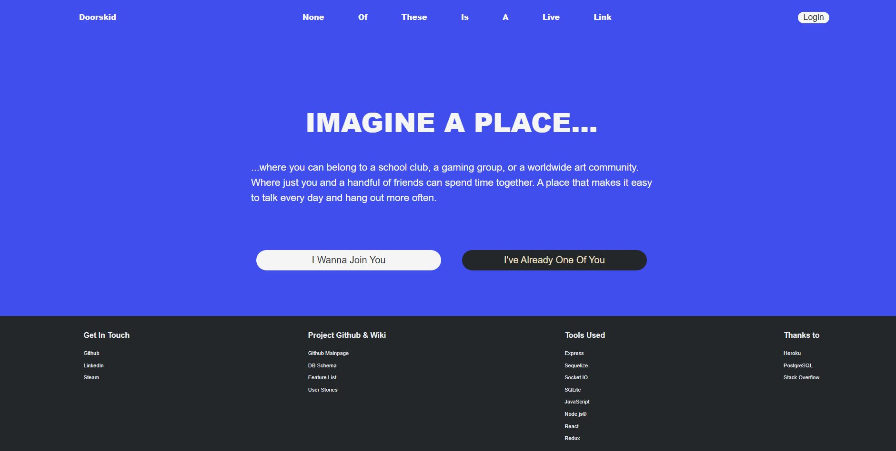

### Login & Signup

For demo user, you can click the login, and click demo user.

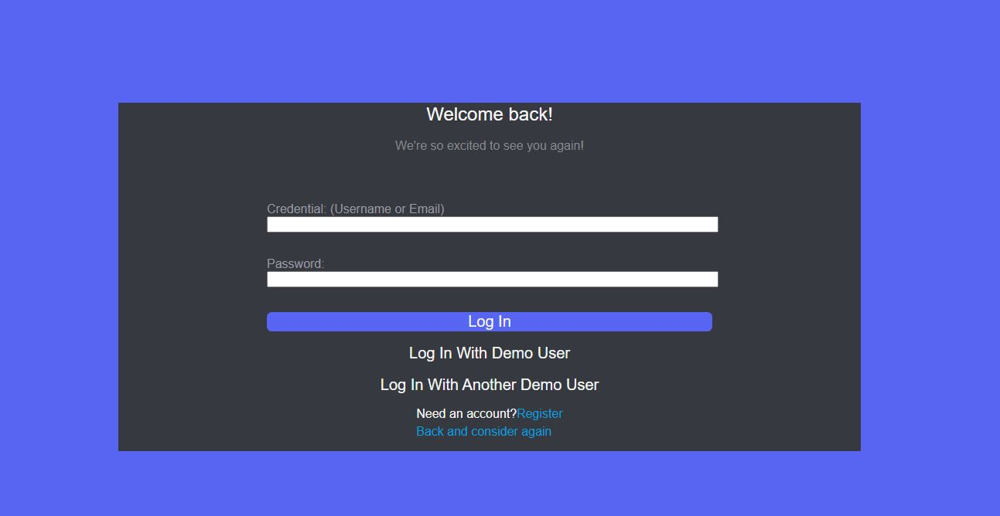
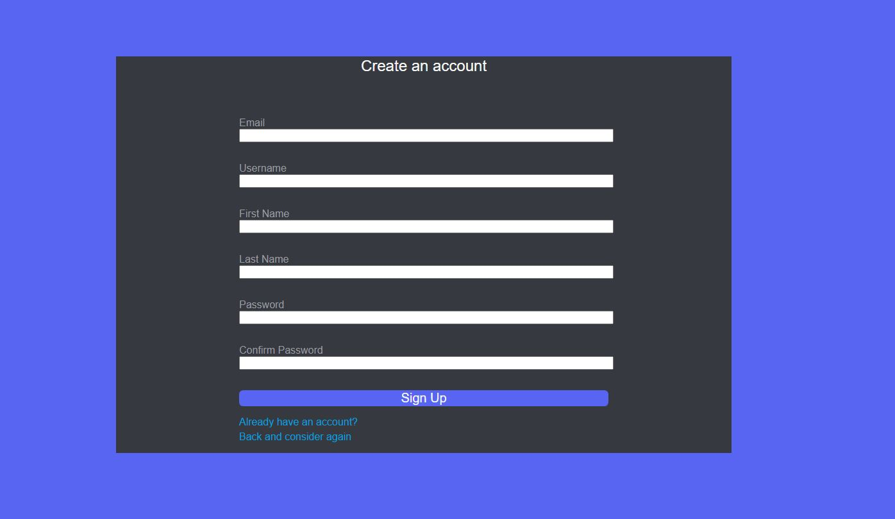

The route for chatting main page is '/'.

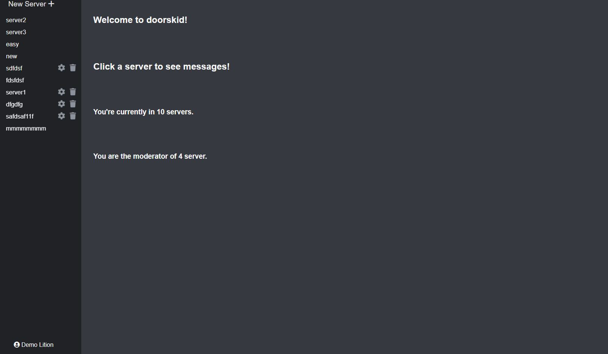

The logged in user could see the profile menu from the navbar.

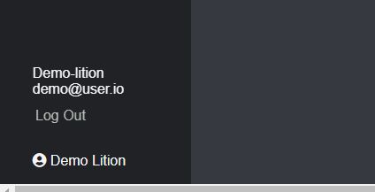

Users could go back to the main page when in a channel.

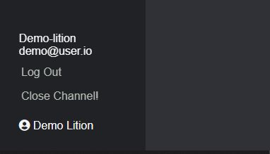

### Server

User have full CRUD function for server. U and D are only permitted to the owner of the server.

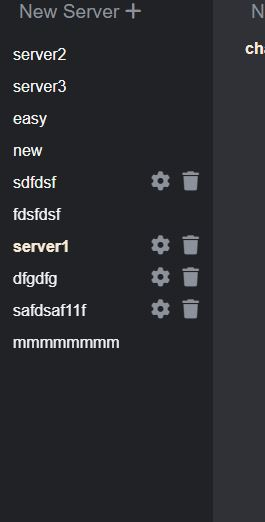
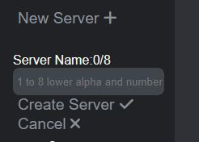
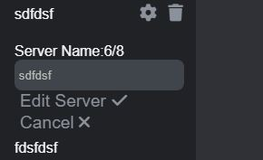
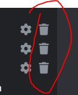

### Channel

User have full CRUD function for channel. U and D are only permitted to the owner of the server that the channel is in.

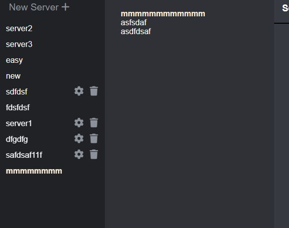
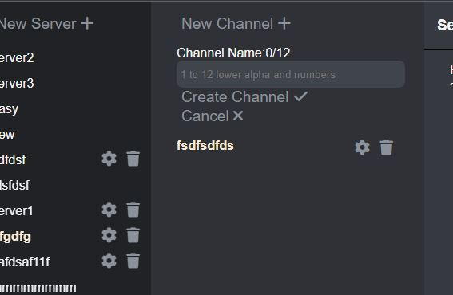
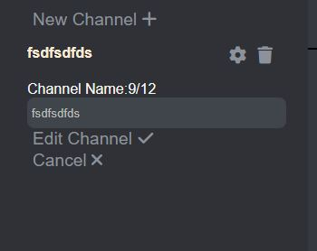
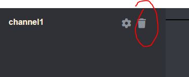

### Channel

Messages are live messages. All CRUD for the messages are triggered with SOCKET.IO so the other user could see the message list live.

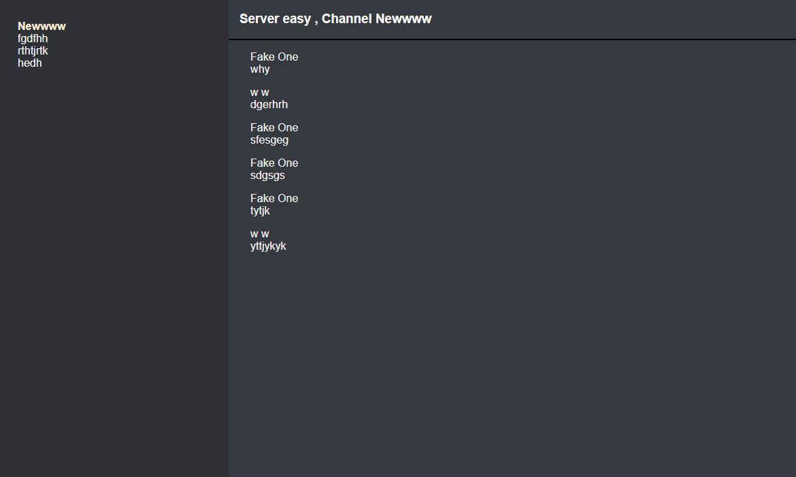
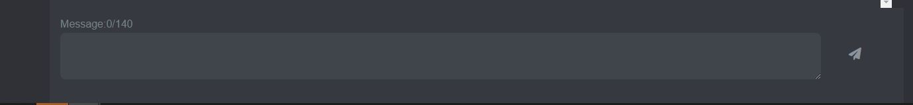

For the servers without channels, the messages funcion is blocked until a new channel is created.

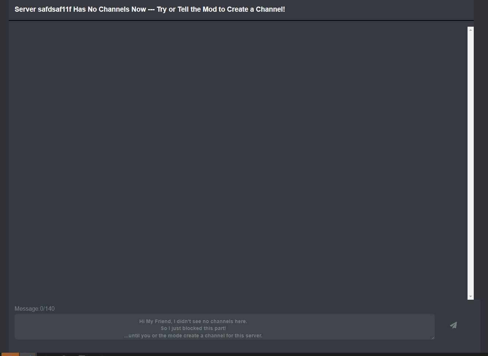
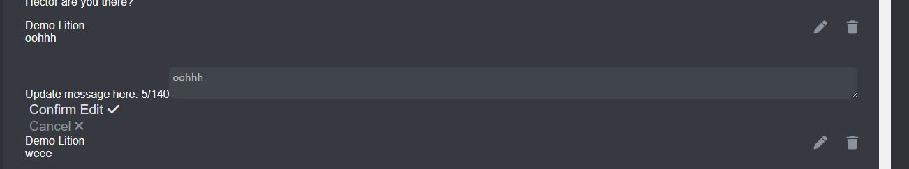
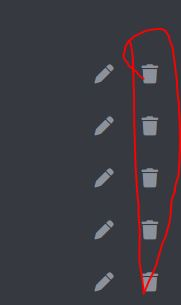
